# Composer

Official repo for [Composer: Creative and Controllable Image Synthesis with Composable Conditions](https://arxiv.org/abs/2302.09778).

See [Project Page](https://damo-vilab.github.io/composer-page/) for more examples.

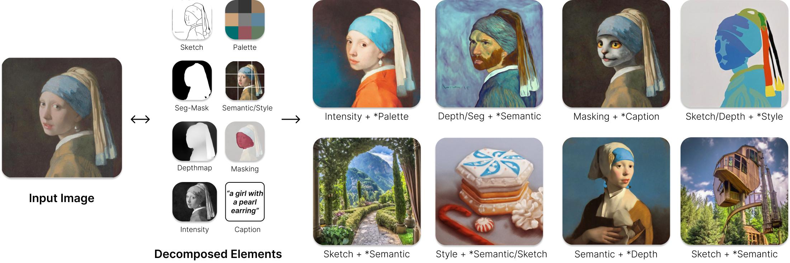
<!-- *(Concept of Composer)* -->

Composer is a large (5 billion parameters) controllable diffusion model trained on billions of (text, image) pairs. It can exponentially expand the control space through composition, leading to an enormous number of ways to generate and manipulate images, i.e., making *the infinite use of finite means*.


## TODO

- [ ] Release training and inference code.
- [ ] Release pretrained models.
- [ ] Release Gradio UI.
- [ ] A light-weighted Latent-Composer built upon Stable Diffusion 2.0.


## Composition Results

### Composition of **text** and **depth**.

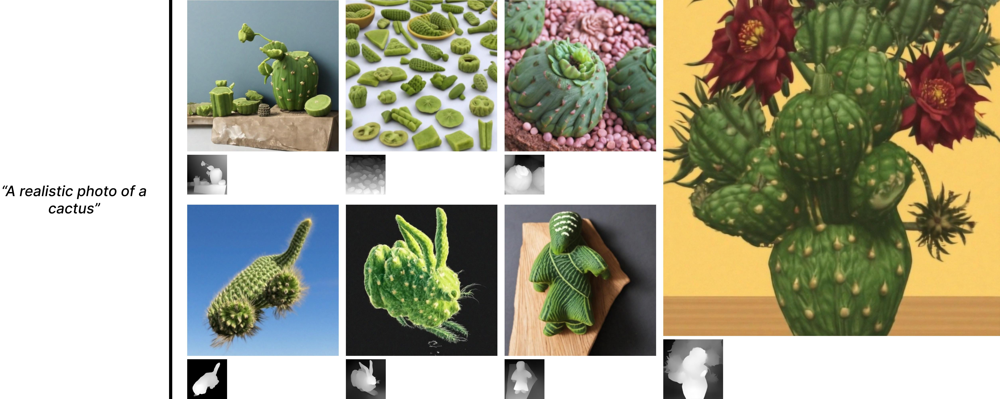

### Composition of **masked image** and **text**.


### Composition of **sketch, depth** and **embedding** (1).

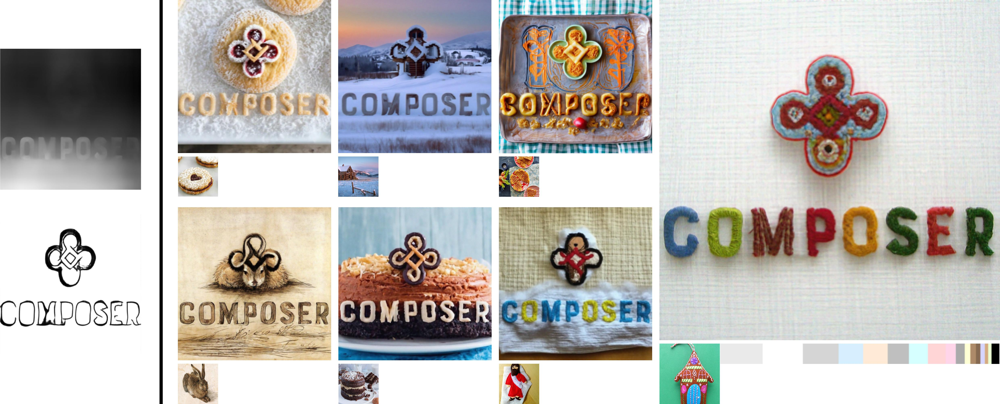

### Composition of **sketch, depth** and **embedding** (2).

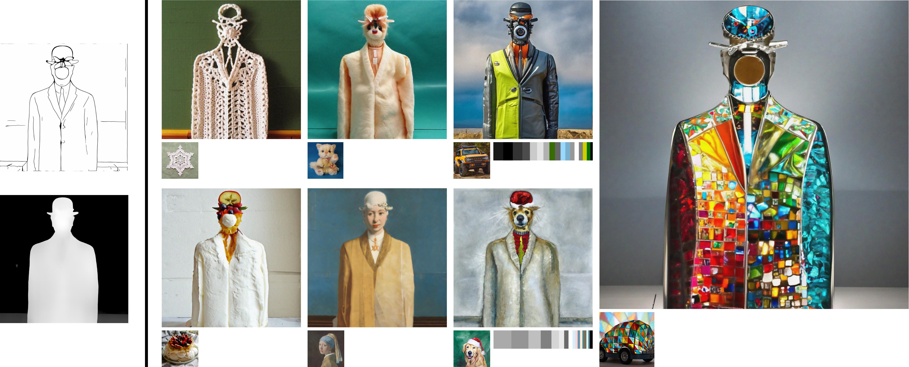

### Composition of **text** and **palette**.

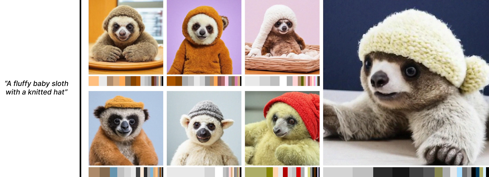

### Composition of **embedding** and **palette**.

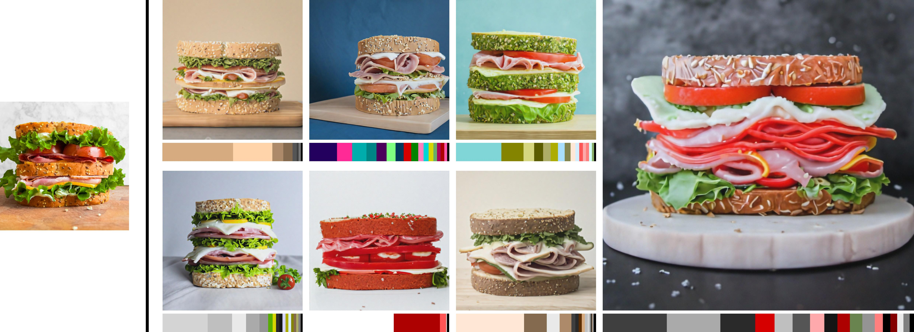

### Composition of **intensity** and **palette**.

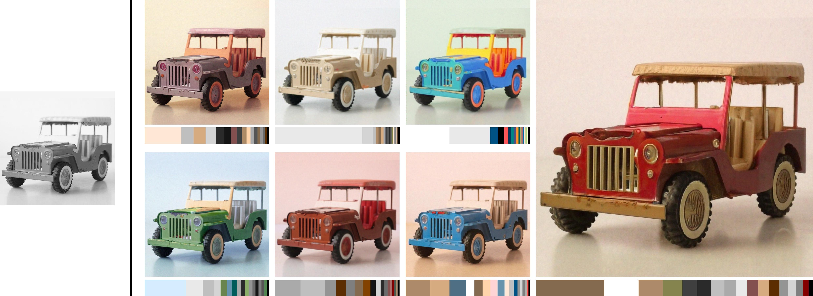


## Manipulation Results

### **Image variations** when fixing **sketch, depth, palette** and/or **embedding**.

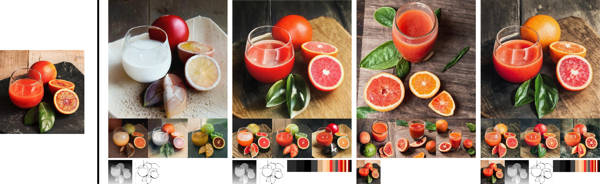

### **Image interpolations** when fixing **sketch, depth, segmentation map** and/or **palette**.

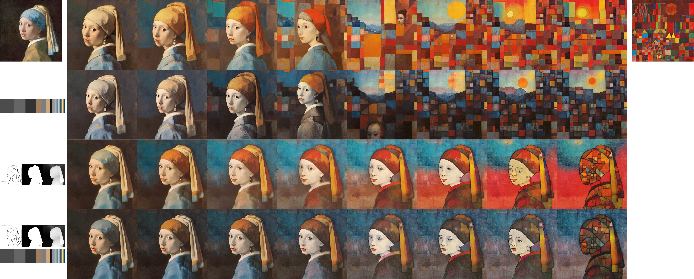

### **Image reconfigurations** (manipulating an image by directly modifying its elements).


### **Color interpolations.**

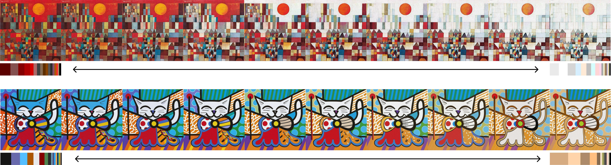

### **Region-specific image editing.**

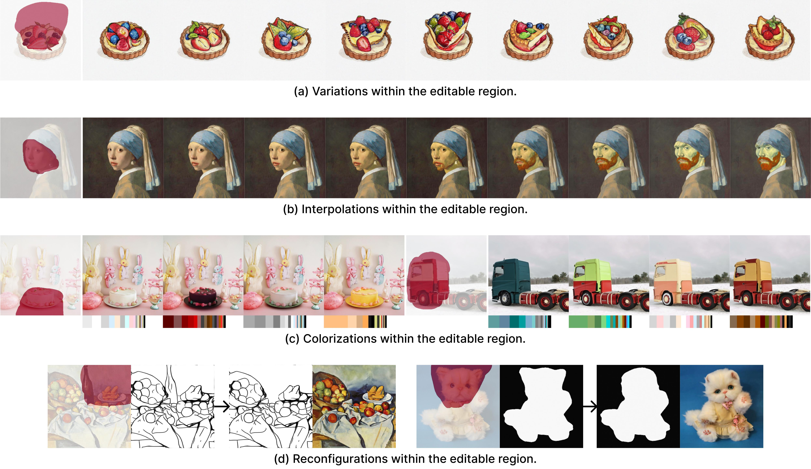


## Reformulation of Classical Tasks

### **Image translation.**

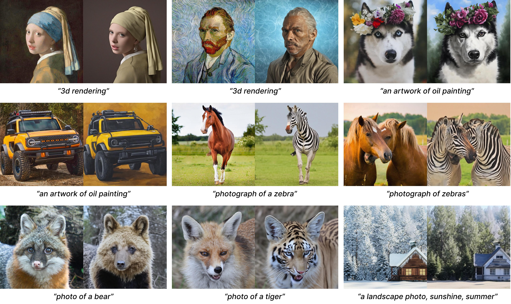

### **Style transfer.**

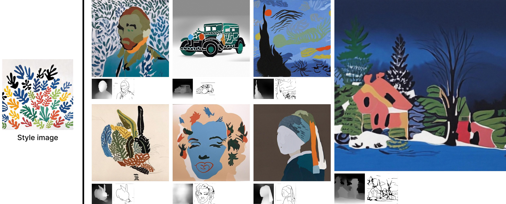

### **Pose transfer.**

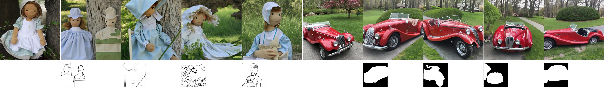

### **Virtual try-on.**

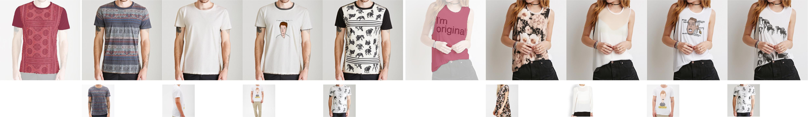


## BibTeX

```bibtex
@article{lhhuang2023composer,
  title={Composer: Creative and Controllable Image Synthesis with Composable Conditions},
  author={Huang, Lianghua and Chen, Di and Liu, Yu and Yujun, Shen and Zhao, Deli and Jingren, Zhou},
  booktitle={arXiv preprint arxiv:2302.09778},
  year={2023}
}
```
